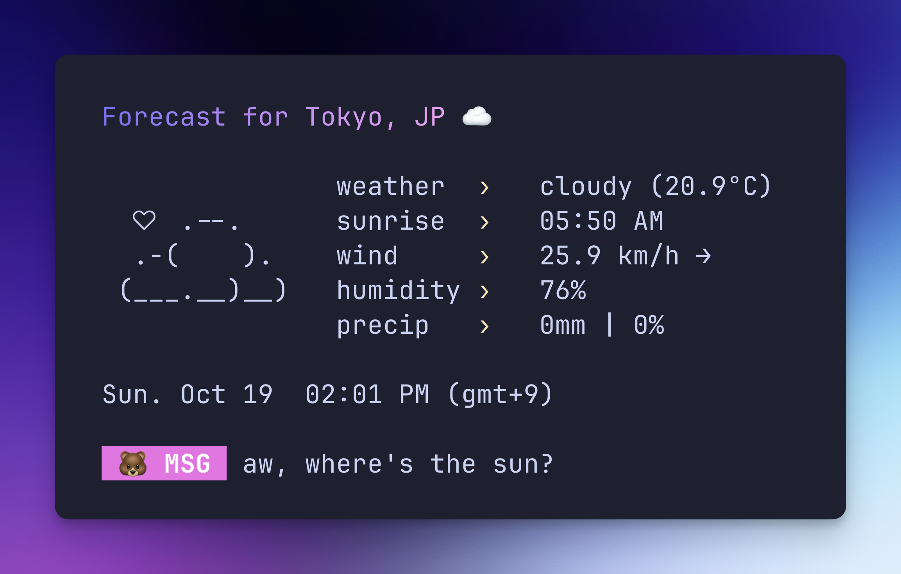

# starlit
A minimal and customizable weather CLI written in Python



Powered by the OpenWeatherMap API and styled with the Python rich library + terminal text effects ✨

## Requirements
- Python 3.13+
- pip package manager
- An [OpenWeatherMap](https://openweathermap.org) API key
- UTF-8 terminal with 256 colors and nerd font

## Installation
1. **Clone this repository**
```zsh
git clone https://github.com/ashuhlee/starlit.git
cd starlit
```

2. **Create a virtual environment (optional)**

Do this if you'd like starlit dependencies clean and separate from other Python projects

Create the virtual environment:
```zsh
# macOS / Linux / Windows
python -m venv venv
```

Activate the virtual environment:
```zsh
# macOS / Linux
source venv/bin/activate
```

```zsh
# Windows (Command Prompt)
venv\Scripts\activate.bat
```

3. **Install dependencies**

Some packages are required for this project. They will automatically be installed if you run:
```zsh
pip install .
```
4. **Create your `.env` file**

Copy the example environment file by using this flag:

```zsh
# macOS / Linux / Windows
starlit --setup
```

> Get your API key from [OpenWeatherMap](https://openweathermap.org/api)
> 

## Configuration
starlit uses a `.env` file to store user specified settings — things like your API key, default city, and how you want the app to look in your terminal.

`API_KEY`: Your OpenWeatherMap API key

### Open the .env file and paste your API key
```zsh
# macOS / Linux / Windows
starlit --edit # Opens the .env file in your default editor
```

### Customize default settings (optional)

| Setting             | Default   | What it does                           |
| ------------------- |-----------|----------------------------------------|
| `DEFAULT_CITY`      | `Seattle` | The city shown when you don’t pass one |
| `UNITS`             | `metric`  | Use `metric` (°C) or `imperial` (°F)   |
| `DISABLE_ANIMATION` | `false`   | Turns off the title animation          |
| `SHOW_DT`           | `true`    | Shows local date and time              |
| `SHOW_ASCII`        | `true`    | Shows the little ASCII art to the left |
| `SHOW_MSG`          | `true`    | Adds a cute message at the bottom      |
| `SHOW_EMOJI`        | `true`    | Shows emojis in your terminal          |
| `EMOJI_TYPE`        | `🐻`      | Choose a cute emoji for messages       |

### Customize colors (optional)
You can also set your own colors for the gradient title and message labels.
Use **six-digit** RGB hex codes (no # needed):

```
COLOR_1=ffb6c1     # Gradient color stop 1
COLOR_2=9370db     # Gradient color stop 2
LABEL_COLOR=ffd700 # Color for the message label
```

## Usage

```
# basic usage
starlit

# specify city via command line
starlit tokyo

# start interactive mode
starlit --interactive 

# opens the .env file in your default editor
starlit --edit

# shows config in .env file (if found)
starlit --config

# shows contents of .env file (if found)
starlit --config --show-full

# show version
starlit --version

# show help
starlit --help
```

## Tech stack

- **[Rich](https://github.com/Textualize/rich)** - Beautiful terminal formatting
- **[rich-gradient](https://github.com/maxludden/rich-gradient)** - Gradient text formatting
- **[terminal-text-effects](https://github.com/ChrisBuilds/terminaltexteffects)** - Smooth text animations
- **[Requests](https://pypi.org/project/requests/)** - HTTP requests for weather API
- **[Python-dotenv](https://pypi.org/project/python-dotenv/)** - Environment variable management


## About this project
I built this fun little project as a way to learn more about APIs and creating colorful terminal apps. It grew into a CLI project I'm proud of!

This project is an active work in progress. Thank you to [charm](https://github.com/charmbracelet) for the color palette inspo 🎨 and to [wego](https://github.com/schachmat/wego/tree/master) for the ASCII icons

⭐ If you like this project, please consider giving it a star!