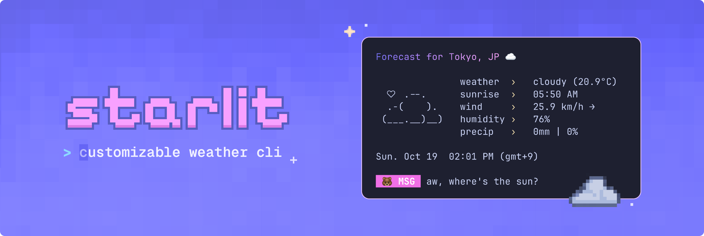
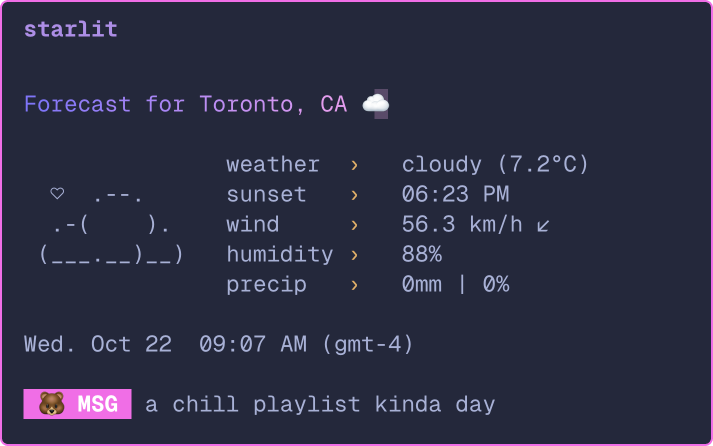
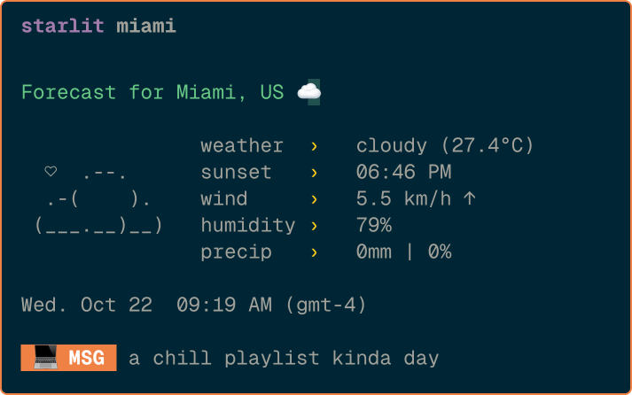
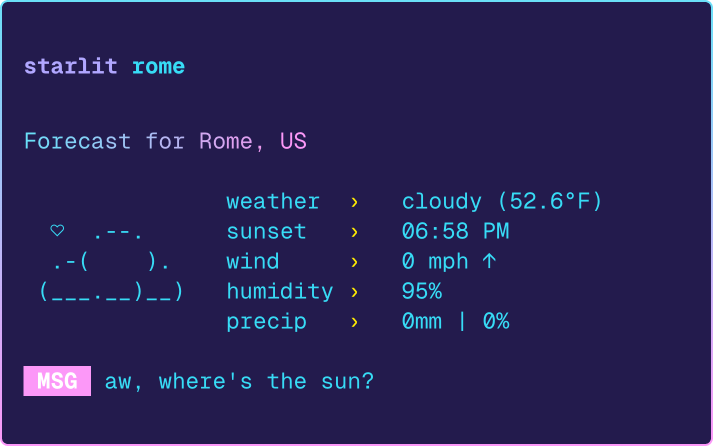
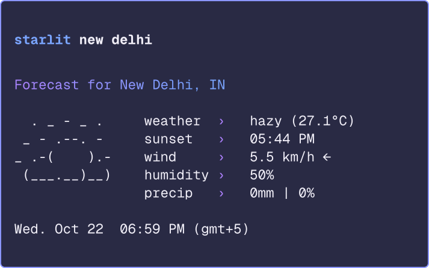
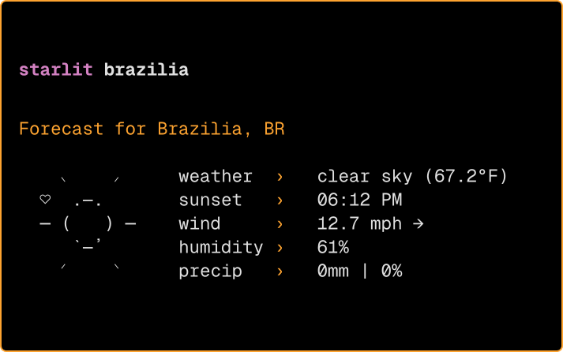
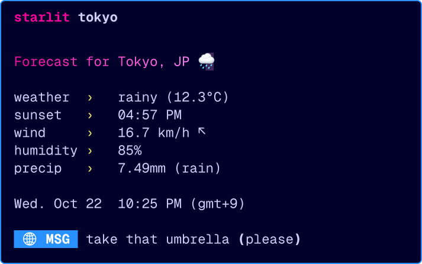

<div align="center">

# starlit
A minimal and customizable weather CLI, written in Python 🐍


Powered by the OpenWeatherMap API and styled with the Python rich library + terminal text effects ✨


</div>

## Requirements
- Python 3.13+
- Poetry or pip package manager
- An [OpenWeatherMap](https://openweathermap.org) API key
- UTF-8 terminal with 256 colors and nerd font

## Installation
You can install starlit with pip or the [Poetry](https://python-poetry.org/docs/) package manager, depending on your preferred workflow.

### Install with pip
1. **Clone this repository**
```zsh
git clone https://github.com/ashuhlee/starlit.git
cd starlit
```

2. **Create a virtual environment (optional)**

Do this if you'd like to keep starlit’s dependencies clean and separate from other Python projects.

Create the virtual environment:
```zsh
# macOS / Linux / Windows
python -m venv .venv
```

Activate the virtual environment:
```zsh
# macOS / Linux
source .venv/bin/activate
```

```zsh
# Windows (Powershell)
.venv\Scripts\Activate
```

3. **Install dependencies**

Some packages are required for this project. They will automatically be installed if you run:
```zsh
pip install .
```
4. **Set up your `.env` file**

Generate your configuration file from the example template:

```zsh
starlit --setup
```

Alternatively, you can manually copy the .env.example file:

```zsh
cp .env.example .env
```

Then open it in your default editor:
```zsh
starlit --edit
```

### Install with Poetry

1. **Clone this repository**
```zsh
git clone https://github.com/ashuhlee/starlit.git
cd starlit
```

2. **Install dependencies**

Install project dependencies and set up a virtual environment automatically:
```zsh
poetry install
# run the command that prints out when you run:
poetry env activate
```

3. **Set up your `.env` file**

Generate your configuration file from the example template:

```zsh
starlit --setup
```

Then open it in your default editor:
```zsh
starlit --edit
```

Get your [OpenWeatherMap API key](https://openweathermap.org/api) and paste it into the `.env` file under `API_KEY=`

## Configuration
starlit uses a `.env` file to store your API key, default city, and display preferences

| Setting             | Description                               |
|---------------------|-------------------------------------------|
| `API_KEY`           | Your OpenWeatherMap API key               |
| `DEFAULT_CITY`      | The city shown when you don’t pass one    |
| `UNITS`             | Options: `metric` (°C) or `imperial` (°F) |
| `DISABLE_ANIMATION` | Turns off all animations in starlit       |
| `SHOW_DT`           | Shows local date and time                 |
| `SHOW_ASCII`        | Shows the little ASCII art to the left    |
| `SHOW_MSG`          | Adds a cute message at the bottom         |
| `SHOW_EMOJI`        | Shows emojis in your terminal             |
| `EMOJI_TYPE`        | Choose a cute emoji for messages          |


### (Optional) Customize colors
You can also set your own colors for the gradient title and message labels.
Use **six-digit** RGB hex codes (no # needed):

| Setting     | Description           | Example                                                                |
|-------------|-----------------------|------------------------------------------------------------------------|
| COLOR_1     | Gradient color stop 1 |  5D63FF |
| COLOR_2     | Gradient color stop 2 |  F7A4F4 |
| LABEL_COLOR | Message label color   |  5CE7F9 |

## Usage

```zsh
# basic usage
starlit

# specify city via command line
starlit seattle

# start interactive mode
starlit --interactive 

# opens the .env file in your default editor
starlit --edit

# shows config in .env file (if found)
starlit --config

# shows contents of .env file (if found)
starlit --config --show-full

# show version
starlit --version

# show help
starlit --help
```

## Usage examples

|  |  |
|----------------------------------------------------|----------------------------------------------------|
|  |  |
|  |  |


## What's next
* 🎨 **Color Themes:** Support for `.json` theme files so you can easily switch between color palettes
* 🌍 **Multi-language Support:** Option to view weather info in different languages

## Tech stack

- **[Rich](https://github.com/Textualize/rich)** - Beautiful terminal formatting
- **[rich-gradient](https://github.com/maxludden/rich-gradient)** - Gradient text formatting
- **[terminal-text-effects](https://github.com/ChrisBuilds/terminaltexteffects)** - Smooth text animations
- **[Requests](https://pypi.org/project/requests/)** - HTTP requests for weather API
- **[Python-dotenv](https://pypi.org/project/python-dotenv/)** - Environment variable management


## About this project
I built this fun little project as a way to learn more about APIs and creating colorful terminal apps. It grew into a CLI project I'm proud of!

Thank you to [charm](https://github.com/charmbracelet) for the color palette inspo 🎨 and to [wego](https://github.com/schachmat/wego/tree/master) for the ASCII icons

⭐ If you like this project, please consider giving it a star!