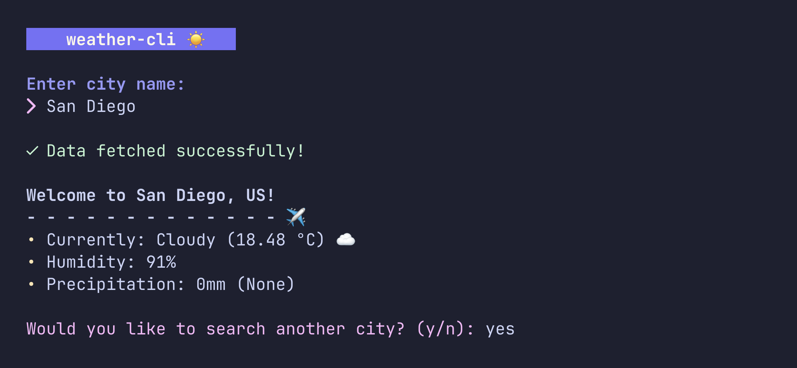

# weather-cli 🌥️
weather-cli is a lightweight and colorful terminal application that lets you check the current weather for any city in the world.

Powered by the OpenWeatherMap API and styled with the Python rich library ✨


## About this project
I built this fun little project as a way to learn more about APIs and creating colorful terminal apps. It turned into a CLI project I'm proud of!



## Requirements
- Python 3.10+
- Packages
  - [requests](https://pypi.org/project/requests/): used to make http requests to the api
  - [python-dotenv](https://pypi.org/project/python-dotenv/): loads the api key in the .env file
  - [rich](https://rich.readthedocs.io/en/latest/introduction.html): for terminal styling
- An [OpenWeatherMap](https://openweathermap.org) API key

## Usage
Clone this repository
```zsh
git clone https://github.com/ashuhlee/weather-cli.git
cd weather-cli
```
Create a `.env` file to store your API key.
```
echo "API_KEY=your_openweather_api_key" > api.env
```
Run the `main.py` file located in `/src`
```
cd src
python main.py
```

## Project structure
To make sure everything works properly, make sure your files are structured correctly :)
```
weather-cli/
│
├── src/
│   ├── main.py
│   ├── ui/
│   │   ├── __init__.py
│   │   ├── animations.py
│   │   ├── styles.py
│   │   ├── emojis.py
│   │   └── imports.py
│   └── ...
│
├── .env
└── README.md
```

## Credits
- [rich](https://github.com/Textualize/rich) for the cli styling
- [OpenWeatherMap](https://openweathermap.org) for the weather api
- [charm](https://github.com/charmbracelet) for the color palette inspo 🎨

Disclaimer: the project and README is an active work in progress